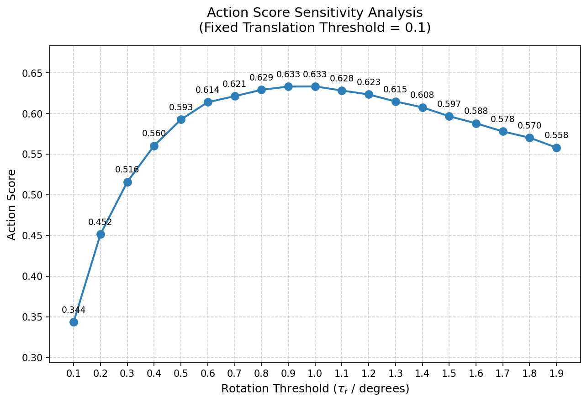
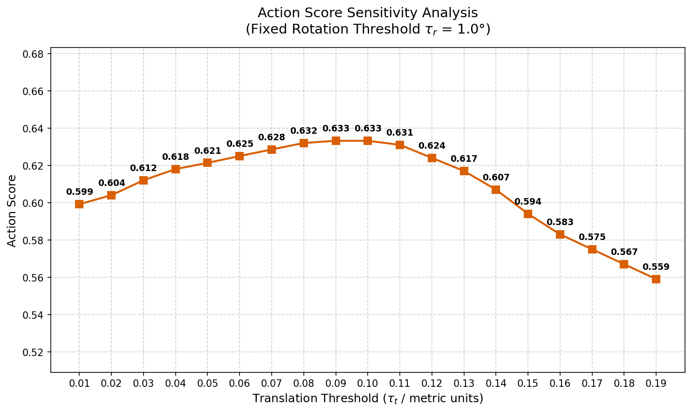

  <table>
    <tr>
      <td align="center">
         
        <b>(a) Rotation Sensitivity</b>
      </td>
      <td align="center">
         
        <b>(b) Translation Sensitivity</b>
      </td>
    </tr>
  </table>
  
<b>Fig. 1: Action Score Sensitivity to Evaluation Thresholds.</b>

